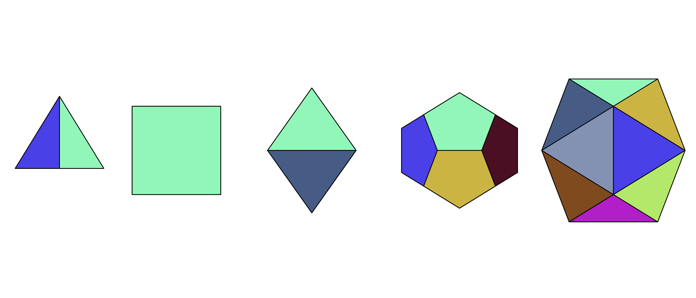

Psolids is a filter for generating platonic solid specifications in the
form of input to Jgraph, a filter for plotting graphs in PostScript:
https://web.eecs.utk.edu/~jplank/plank/jgraph/jgraph.html.

A platonic solid -- tetrahedron, hexahedron, octahedron, dodecahedron,
icosahedron -- is a regular polyhedron, meaning it is composed of flat
polygonal faces which are identical in size and shape. Given a
location of its centroid (i.e., center of mass), and an edge length
(i.e., the distance between any two adjacent vertices, or points),
the locations of the vertices are well-defined, and can therefore be
plotted (on) a three-dimensional Cartesian coordinate system.

A rotation of any three-dimensional object may be thought of as a
sequence of rotations about one or more of the three coordinate axes.
Matrix multiplication gives us a way to perform a
three-dimensional rotation on a point in three-dimensional space.
Since a platonic solid may be thought of simply as a collection of
points (vertices), it also gives us a way to perform a rotation on
these regular polyhedra.

Orthographic projection, a type of parallel projection, provides a
means by which to represent a three-dimensional object in two
dimensions. It is inferior to perspective projection in that it
fails to capture depth, and thus cannot make readily apparent
the fact that one object is more or less distant than another.
But orthographic projection is simpler than perspective
projection, not requiring one to select a plane on which to
project or a distance from which an object is to be viewed.
Finding value in its simplicity, the psolids program uses
orthographic projection to create images of platonic solids.

The above information captures the essence of the thought process
behind psolids. A shape is formed given an edge length and a
center of mass (which may be the defaults), rotated given a
rotation about one or more of the three coordinate axes, and then
projected onto a plane, creating an image.

Psolids provides six commands with which one can edit the
appearance of a platonic solid:

  edgelength {double}
  center     {double double}
  roll       [degrees/radians] {double}
  pitch      [degrees/radians] {double}
  yaw        [degrees/radians] {double}
  faces      {integer}+ {color} {double double double}

The `edgelength` command requires a double, the value of which is
interpreted as being in units of points, as used by PostScript,
where 72 points (the default edge length) is equivalent to one
inch.

The `center` command is used to control where the image of a
shape lies on its graph. It requires two doubles x and y where
(x,y) is the ordered pair corresponding to the final position
of the centroid of a shape. If 'center' is not specified, then
the origin (0,0) is used. Note that the centroid of the
tetrahedron is not located in the middle of the shape, but
closer to its base, and so a simple calculation is required in
order to place the middle of an image of a tetrahedron at a
specific location.

The `roll`, `pitch`, and `yaw` commands affect the orientation
of the shape. They take an optional token 'degrees' or
'radians' (radians being the default, and therefore not
necessary to specify), and then a double. On any valid double
the rotation will work as expected. Therefore, specifying
"pitch degrees 720.0" will essentially cause the shape to
perform two backflips, but end up in its original position.

The `faces` command is used to modify the color of one or more
faces of a shape. Following the 'faces' keyword, one or more
face ids must follow (face ids being zero-indexed), where a
face id is simply a number greater than or equal to one and
less than the number of faces of the shape. For example, the
valid face ids for a hexahedron (cube) are the integers 0-5.
Face ids must be separated by whitespace (e.g., 0 1 3 5).
Following the face ids of the faces whose colors are to be
modified should be the keyword "color", which itself should
be followed by three doubles, corresponding to rgb values.
Therefore, if one wished to color red the faces 0, 1, 3, and
5, the command would look close to the following:
  ```
  faces 0 1 3 5 color 1.0 0.0 0.0
  ```
In addition to the above commands, psolids allows the user to
modify the appearance of the overall shape using Jgraph
commands. The following Jgraph commands are supported:
  ```
  marktype
  marksize
  mrotate
  gray
  color
  fill
  cfill
  pattern
  pfill
  pcfill
  ppattern
  linetype
  linethickness
  clip
  noclip
  ```
A description of these commands may be found here:
https://manpages.debian.org/bookworm/jgraph/jgraph.1.en.html.
Unlike Jgraph, psolids does not allow a Jgraph command to be
specified more than once per shape. While this does not restrict
a user's ability to edit the appearance of their shape, it does
require them to be careful when writing shape specifications. A
future version of this program may not impose this restriction,
and rather treat repeated Jgraph commands as is done by Jgraph
and the six psolids commands, simply ignoring all but the last
occurrence of a command.

Psolids by itself does not produce output that can serve as
input to Jgraph. This is because it would not be feasible or
desirable to have to feed all one's Jgraph input through
psolids simply to use the two in conjunction. Rather, psolids
takes advantage of Jgraph's ability to invoke shell commands
and use the output of those commands as input. One of the goals
with psolids was to allow a user of Jgraph to seamlessly
integrate the functionality of psolids into their Jgraph
specifications. Jgraph provides two seamless ways to integrate
the output of one program or pipeline into its input:
include-file statements and shell-include statements. With the
former, a user of psolids can put the output of the program
into a file, and then, in a Jgraph specification, include the
contents of that file with the statement
  ```
  include psolids.out
  ```
where psolids.out contains output of the psolids program. With
the latter, the user is able to make clear their psolids
specification within their Jgraph specification, so that it is
more obvious to a reader what is being done. The following is
a valid shell-include statement that would produce a
tetrahedron with centroid located at the origin:
  ```
  shell : echo newshape tetrahedron | psolids
  ```
This gives us nearly all that is necessary in order to produce
platonic solids of any size, color, and orientation. A few
examples will give an idea of how to use psolids with jgraph
and what can be accomplished with the program.

The following is a Jgraph specification file that creates one of
each of the five platonic solids:
  ```
  newgraph
  xaxis min -100 max 100 nodraw
  yaxis min -100 max 100 nodraw
  shell : echo newshape  tetrahedron center -235.0  0.0 \
               newshape   hexahedron center -140.0  0.0 \
               newshape   octahedron center  -30.0  0.0 \
               newshape dodecahedron center   90.0  0.0 \
               newshape  icosahedron center  215.0  0.0 | psolids
  ```
The output will look something like the following (the image was manually
cropped):


There are a couple of things worth noting about this file and the
image it produces. First, it advisable always to specify axes with
equal minimum and maximum values. If lines 2 and 3 were not included,
Jgraph would do its best to determine what those values should be,
based on the points given to it. Leaving it to Jgraph to determine
the axes tends to result in distorted images of the shapes. Second,
the minimum and maximum values shown above were chosen randomly, and
have an effect on the sizes of the images produced. Larger values
lead to smaller images, and vice versa. It is not yet known what
values must be chosen in order to produce images equivalent to
PostScript points. Third, the `nodraw` keyword is a Jgraph
graph editing command used so that the axis to which it applies is
not drawn. Fourth, we are giving psolids nothing more than the
name of the shape we wish to produce an image of, and a place to
put the image of that shape (determined as described above).
Psolids attempts to make it easy to quickly generate a shape,
while also allowing more complex editing through the use of
Jgraph commands. Fifth, the values following the `center`
keywords were specified as doubles only to reinforce the fact that
this command takes two doubles. Specifying those values as
integers would have produced the same result. Sixth, these values
were chosen experimentally so as to provide an appropriate amount
of spacing between each shape. Last, it can be seen psolids
chooses a random color for each face by default.

The previous example revealed that psolids can take its input on
standard input. It can also take its input from files specified
on the command line. Each file specified must either be empty or
contain at least one valid shape specification. Psolids will
print the image corresponding to each valid shape specification
until it reaches an invalid specification, in which case it will
flag the error and exit. The following example demonstrates
using psolids by specifying files on the command line as well as
a few commands not shown in the previous example:

  ```
  $ # create three files, one of them empty
  $ echo 'newshape hexahedron
  > roll degrees 15
  > pitch -6.28                  # taken as radians (roughly -360 degrees)
  > pcfill 1 0 0                 # color faces red
  > faces 1 color 0 0 1          # but color face 1 blue
  > ' >f1                        # store in the file f1
  $ >f2                          # create an empty file f2
  $ echo 'newshape dodecahedron
  > color 1 0 0                  # make the edges red
  > linethickness 5              # and thick
  > pcfill 1 1 1                 # color the faces white
  > faces 0 3 6 9 11 color 0 0 1 # now color some of them blue
  > roll degrees 15              # rotate shape a bit
  > pitch degrees 15
  > yaw degrees 15
  > center -175 0' >f3           # make sure the two shapes do not overlap
  $ ls
  f1  f2  f3
  $ # create the jgraph specification file j.in
  $ echo 'newgraph
  > xaxis min -100 max 100 nodraw
  > yaxis min -100 max 100 nodraw
  > shell : psolids f1 f2 f3' >j.in
  $ # run jgraph and see what we get
  $ jgraph -P j.in >junk.ps; open junk.ps
  ```

Here is the output:


One thing is worth nothing here. The matching of faces to
face ids is more or less intuitive with the tetrahedron,
hexahedron, and octahedron, but not at all with the dodecahedron
and icosahedron. When there is time for it, an image will be
provided that maps face ids to their corresponding faces. For
the time being, the procedures get_shapename() where shapename
is the name of a platonic solid can be studied in order to do
the mapping oneself.

A last example is included with the intent of showing the extent
to which the appearance of a shape may be manipulated using
psolids. Some of what is shown requires a brute-force method of
editing, trying to do what one can using what the program gives
you. Perhaps the program can be polished over time to become
more of a pleasure to use.


